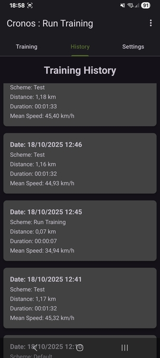
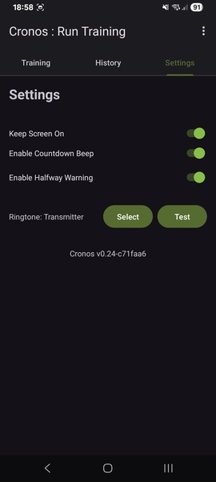

# Cronos: Outdoor Fitness Multi-Timer & Tracker

## Project Description
Cronos is an Android application designed for outdoor fitness enthusiasts. It functions as a versatile multi-timer, allowing users to define and run several custom timers sequentially for structured workouts. Beyond timing, Cronos integrates map-based tracking to monitor user movement during training sessions and provides a comprehensive history of past workouts, including duration, distance, and mean speed. The application is built with a focus on user experience, featuring a clean interface and customizable settings.

## Features
*   **Multi-Timer Functionality:** Create and manage multiple sequential timers for varied training routines.
*   **Session Management:** Start, pause, stop, and reset entire training sessions.
*   **Map-Based Tracking:** View your movement during active training sessions on an integrated map.
*   **Training History:** View a detailed history of past training sessions, including:
    *   Date and Time
    *   Training Scheme Name
    *   Total Distance Covered (km)
    *   Total Duration (HH:MM:SS)
    *   Mean Speed (km/h)
*   **Delete History Records:** Easily remove individual training sessions from your history.
*   **Customizable Settings:**
    *   Select a default ringtone for timer completion.
    *   Enable/disable a countdown beep before timers end.
    *   Toggle "Keep Screen On" during active sessions.
    *   Enable/disable a "Halfway Warning" vocal prompt during long sessions.
*   **Intuitive UI:** A user-friendly interface with a tabbed navigation for Timers, Map, History, and Settings.
*   **Standardized Color Scheme:** A visually appealing palette featuring green, brown, and khaki tones.
*   **Custom Launcher Icons:** Unique application icons for a personalized look.

## Screenshots






## Installation and Setup

The binary of the last generated application is available for download at: [https://github.com/jplozf/Cronos/releases](https://github.com/jplozf/Cronos/releases).

If you prefer to build and run Cronos on your Android device or emulator, follow these steps:

1.  **Clone the Repository:**
    ```bash
    git clone https://github.com/jplozf/Cronos.git
    cd Cronos
    ```
    
2.  **Open in Android Studio:**
    *   Launch Android Studio.
    *   Select `File > Open` and navigate to the cloned `Cronos` directory.

3.  **Sync Gradle:**
    *   Android Studio should automatically prompt you to sync the project with Gradle. If not, click `File > Sync Project with Gradle Files`.

4.  **Google Maps API Key (Optional, for full map functionality):**
    *   The map feature uses OSMDroid, which doesn't strictly require a Google Maps API key. However, if you plan to integrate Google Maps in the future or use specific map services, you might need one. Refer to the `AndroidManifest.xml` for any commented-out sections related to Google Maps API keys.

5.  **Build and Run:**
    *   Connect an Android device or start an Android emulator.
    *   Click the `Run` button (green triangle) in Android Studio to build and install the app on your selected device/emulator.

## Usage

### Timers Tab
*   **Add Timer:** Use the Floating Action Button (FAB) to add new timers.
*   **Edit Timer:** Click on a timer item to edit its label, duration, ringtone, or vocal prompt setting.
*   **Control Session:** Use the Start, Pause, Stop, and Reset buttons to manage the entire timer sequence.

### Map Tab
*   **View Location:** Click the green Map Button on the Timers tab to view your current location on a map.

### History Tab
*   **View Sessions:** See a list of your past training sessions with details like date, scheme, distance, duration, and mean speed.
*   **Delete Session:** Long-press on any training session item to bring up a confirmation dialog to delete it from your history.

### Settings Tab
*   **Keep Screen On:** Prevent the screen from turning off during active training sessions.
*   **Test Sound:** Use the "Test Sound" button to preview your selected ringtone.
*   **Countdown Beep:** Enable/disable a short beep sound in the last few seconds of a timer.
*   **Halfway Warning:** Enable/disable a vocal warning ("Time to go back") at the halfway point of your total training session duration.
*   **Default Ringtone:** Select a default notification sound for your timers.

## License
This project is licensed under the GNU General Public License - see the [LICENSE.md](LICENSE.md) file for details.
